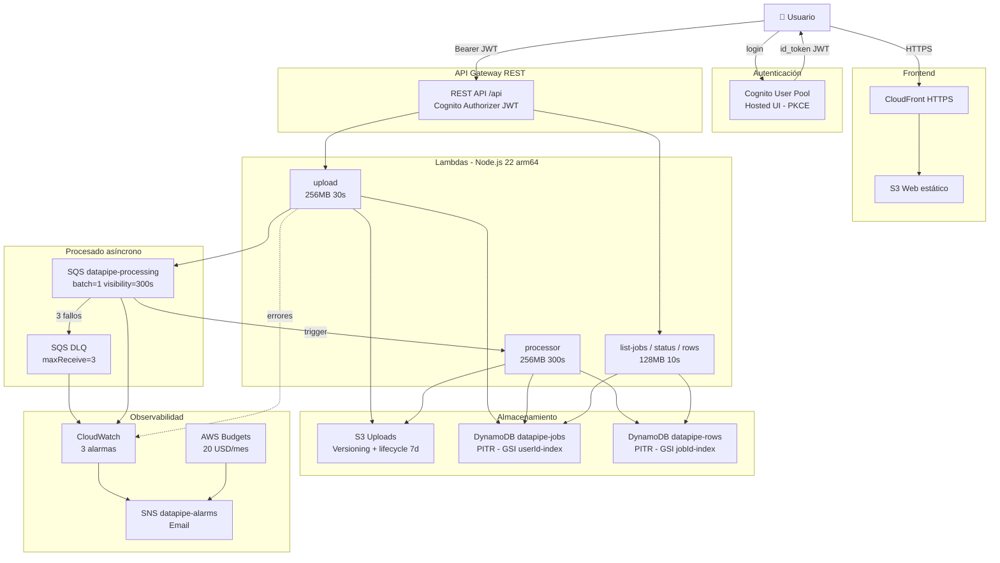

```mermaid
graph TB
    U["👤 Usuario"]

    subgraph frontend ["Frontend"]
        CF["CloudFront HTTPS"]
        S3F["S3 Web estático"]
    end

    subgraph auth ["Autenticación"]
        COG["Cognito User Pool\nHosted UI - PKCE"]
    end

    subgraph api ["API Gateway REST"]
        APIGW["REST API /api\nCognito Authorizer JWT"]
    end

    subgraph lambdas ["Lambdas - Node.js 22 arm64"]
        L1["upload\n256MB 30s"]
        L2["processor\n256MB 300s"]
        L3["list-jobs / status / rows\n128MB 10s"]
    end

    subgraph storage ["Almacenamiento"]
        S3["S3 Uploads\nVersioning + lifecycle 7d"]
        DDB1["DynamoDB datapipe-jobs\nPITR - GSI userId-index"]
        DDB2["DynamoDB datapipe-rows\nPITR - GSI jobId-index"]
    end

    subgraph async ["Procesado asíncrono"]
        SQS["SQS datapipe-processing\nbatch=1 visibility=300s"]
        DLQ["SQS DLQ\nmaxReceive=3"]
    end

    subgraph obs ["Observabilidad"]
        CW["CloudWatch\n3 alarmas"]
        SNS["SNS datapipe-alarms\nEmail"]
        BUD["AWS Budgets\n20 USD/mes"]
    end

    U -->|HTTPS| CF
    U -->|login| COG
    COG -->|id_token JWT| U
    CF --> S3F

    U -->|Bearer JWT| APIGW
    APIGW --> L1
    APIGW --> L3

    L1 --> S3
    L1 --> DDB1
    L1 --> SQS

    SQS -->|trigger| L2
    SQS -->|3 fallos| DLQ

    L2 --> S3
    L2 --> DDB2
    L2 --> DDB1

    L3 --> DDB1
    L3 --> DDB2

    DLQ --> CW
    SQS --> CW
    L1 -.->|errores| CW
    CW --> SNS
    BUD --> SNS
```
